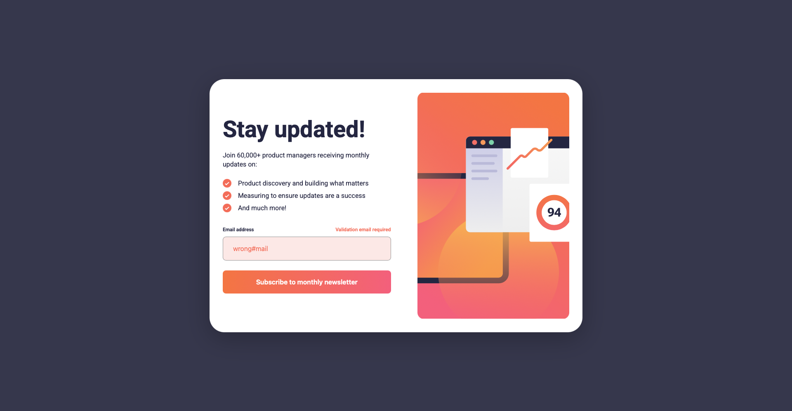

# Newsletter sign-up form with success message solution

This is a solution to the [Newsletter sign-up form with success message challenge on Frontend Mentor](https://www.frontendmentor.io/challenges/newsletter-signup-form-with-success-message-3FC1AZbNrv). Frontend Mentor challenges help you improve your coding skills by building realistic projects. 

## Table of contents

- [Overview](#overview)
  - [The challenge](#the-challenge)
  - [Screenshot](#screenshot)
  - [Links](#links)
- [My process](#my-process)
  - [Built with](#built-with)
  - [What I learned](#what-i-learned)
  - [Continued development](#continued-development)
- [Author](#author)

**Note: Delete this note and update the table of contents based on what sections you keep.**

## Overview

### The challenge

Users should be able to:

- Add their email and submit the form
- See a success message with their email after successfully submitting the form
- See form validation messages if:
  - The field is left empty
  - The email address is not formatted correctly
- View the optimal layout for the interface depending on their device's screen size
- See hover and focus states for all interactive elements on the page

### Screenshot



### Links

- Solution URL: [GitHub Repository](https://github.com/mpujazon/newsletter-sign-up-with-success-message)
- Live Site URL: [Live Site on Vercel](https://newsletter-sign-up-with-success-message-eosin-seven.vercel.app)

## My process

### Built with

- Semantic HTML5 markup
- CSS custom properties
- Flexbox
- Mobile-first workflow

### What I learned

I learned about CSS positioning and styling, as well as JavaScript events. I also finally learned how to use the `<picture>` element properly."

```html
<picture>
      <source media="(min-width: 1080px)" srcset="desktop.svg">
      
</picture>
```

### Continued development

In future projects, I would like to start using a component-oriented JavaScript framework.

## Author

- Website - [Miguel Pujazón](https://mpujazon.dev)
- LinkedIn - [Miguel Pujazón Cárdenas](https://www.linkedin.com/in/mpujazon/)
- Frontend Mentor - [@mpujazon](https://www.frontendmentor.io/profile/mpujazon)
